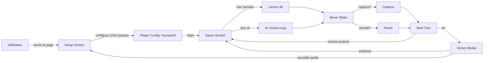
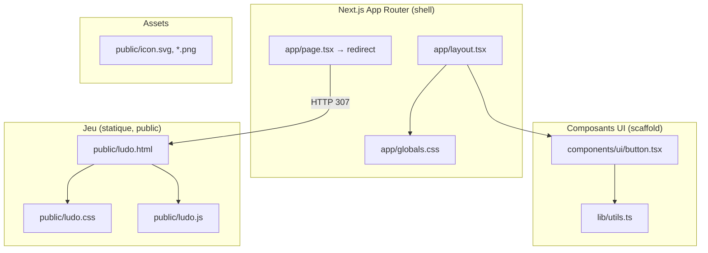
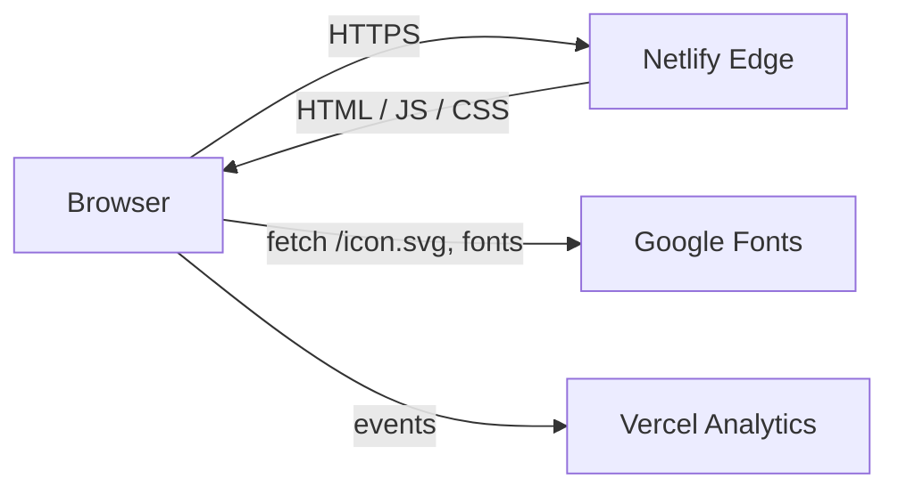
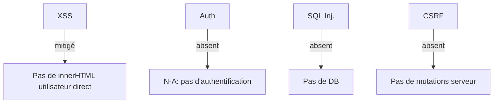
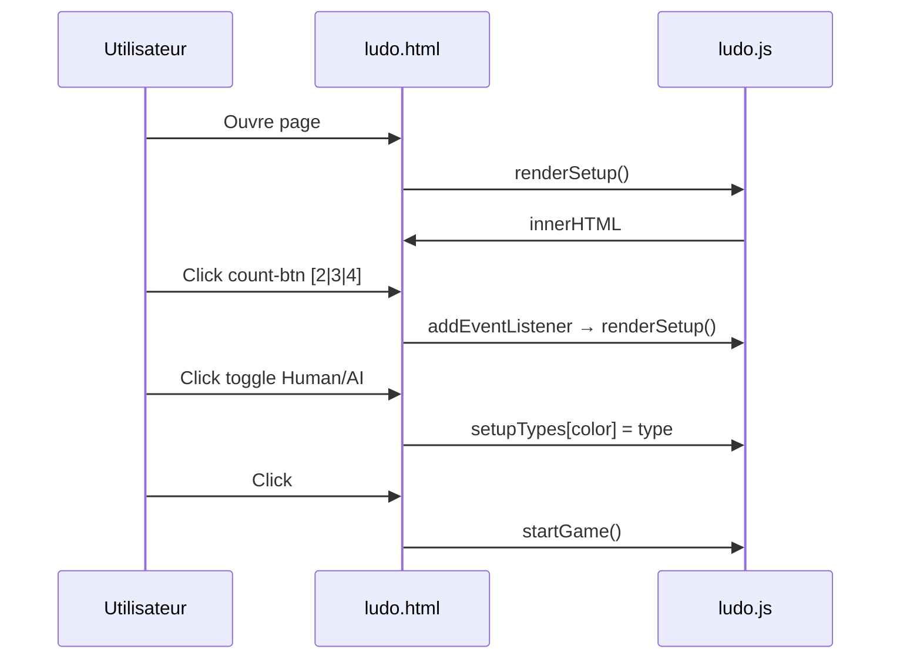
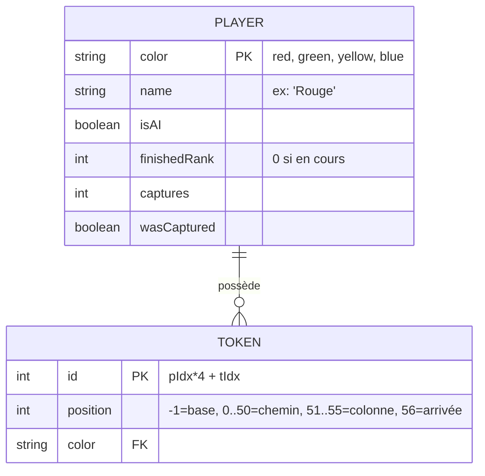
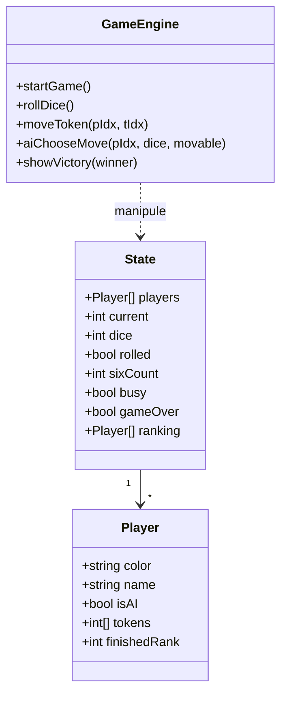
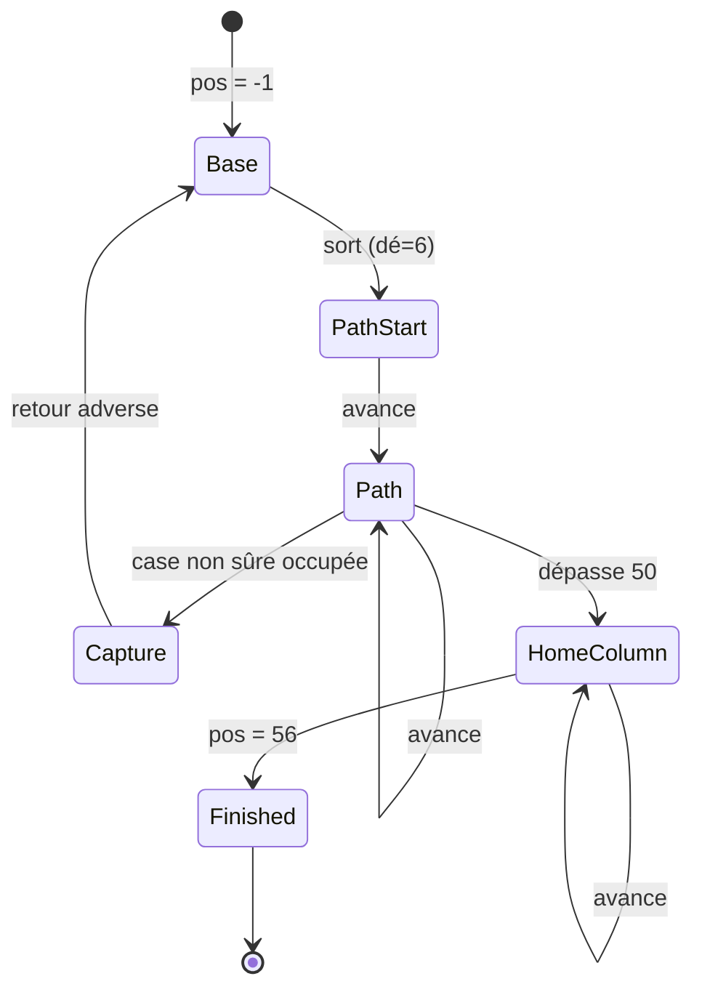
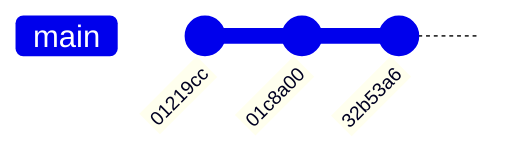

# CONTEXTE.md — Documentation officielle du projet **Ludo**

> **Document de référence unique** — mémoire technique complète du dépôt `i:\TOUS LES PROJETS CLAUDE CODE\JEUX IA\ludo`.
> Cible : développeurs, freelances, agences, IA de génération de code (Claude Code, Cursor, Copilot, etc.).

---

## Table des matières

1. [Vue d'ensemble](#1-vue-densemble)
2. [Architecture complète](#2-architecture-complète)
3. [Stack technique](#3-stack-technique)
4. [Arborescence complète](#4-arborescence-complète)
5. [Fonctionnalités](#5-fonctionnalités)
6. [Documentation complète des fonctions](#6-documentation-complète-des-fonctions)
7. [Documentation des composants](#7-documentation-des-composants)
8. [Documentation des hooks](#8-documentation-des-hooks)
9. [Documentation des services](#9-documentation-des-services)
10. [Documentation des API](#10-documentation-des-api)
11. [Documentation complète de la base de données](#11-documentation-complète-de-la-base-de-données)
12. [Authentification](#12-authentification)
13. [Variables d'environnement](#13-variables-denvironnement)
14. [Déploiement](#14-déploiement)
15. [Sécurité](#15-sécurité)
16. [Performance](#16-performance)
17. [Dette technique](#17-dette-technique)
18. [Workflow développeur](#18-workflow-développeur)
19. [Workflow Git](#19-workflow-git)
20. [FAQ](#20-faq)
21. [Glossaire](#21-glossaire)
22. [Annexes](#22-annexes)

---

## 1. Vue d'ensemble

| Champ | Valeur |
|---|---|
| **Nom du projet** | Ludo (internement `my-project` dans `package.json`) |
| **Nom commercial** | Ludo Royal (affiché dans l'UI) |
| **Type** | Jeu de plateau numérique mono-page |
| **Objectif** | Permettre à 2 à 4 joueurs (humains ou IA) de jouer au jeu de Ludo en ligne, localement, sans serveur applicatif |
| **Public cible** | Grand public amateur de jeux de société classiques |
| **Auteur** | Frédéric VASQUEZ (`Vasquez242`) |
| **Date initiale** | Premier commit : `01219cc` — *Initial commit: Ludo game project* |
| **Date dernière modification** | `32b53a6` — *fix: remove orphan submodule gitlink ludo02 (no .gitmodules URL) → unblocks Netlify build* |
| **Branche** | `main` |
| **Origine** | Généré via l'outil **v0** (Vercel) — confirmé par `metadata.generator = "v0.app"` dans `app/layout.tsx` |
| **Hébergement** | Netlify (configuration `netlify.toml`, adaptateur OpenNext) |
| **Statut** | Stable, prêt à jouer |

### Proposition de valeur

> **Rejouer au Ludo** — le classique jeu de plateau indien — **directement dans le navigateur**, **installable** comme une app native, **multijoueur P2P** par code de salon, avec IA adaptable, achievements, chat, 4 thèmes, 4 skins, et 8 succès débloquables. Premium visuel (thème sombre, dorures, verre dépoli, animations), jouable en FR ou EN, hors ligne.

### Problèmes résolus

- Jouer au Ludo sans plateau physique ni partenaire disponible.
- Découvrir ou redécouvrir les règles du Ludo sans tutoriel complexe.
- **Sauvegarder** une partie en cours et la reprendre après un crash/refresh.
- **Reconnecter** un client multi après une perte réseau (jeton persistant).
- Jouer à **plusieurs à distance** sans serveur applicatif (P2P décentralisé).
- **Installer** le jeu sur mobile (PWA iOS/Android).
- **Adapter** les règles (Express, captures, cases sûres, 3 six…).
- Progresser via un système d'**achievements** et de **télémétrie** locale.

### Périmètre (in/out)

**Inclus :**
- Jeu complet Ludo 2–4 joueurs, règles classiques paramétrables.
- IA adversaire 3 niveaux (Facile/Normal/Difficile).
- Effets sonores synthétiques + musique de fond générée (WebAudio, 0 fichier externe).
- Animations, confettis, modale de victoire.
- Multijoueur P2P décentralisé (PeerJS) avec reconnexion automatique.
- Chat intégré en multi, mode Spectateur.
- Mode Express (2 pions), 6 règles configurables.
- 8 achievements débloquables + télémétrie locale.
- 4 thèmes (Dark/Pastel/Neon/Forest), 4 skins de pions, 2 langues (FR/EN).
- Replay des parties.
- PWA installable iOS/Android avec splash screen + manifest + SW v2.
- Persistance LocalStorage (auto-save + restauration + reconnexion).
- Accessibilité clavier complète (Space/Enter/flèches/M/S/Esc).

**Exclus :**
- Multijoueur avec serveur centralisé (tournois, classements mondiaux).
- Comptes utilisateurs / profils cloud.
- Base de données distante.
- Application mobile native (App Store / Google Play).
- Paiement intégré / monétisation.

---

## 2. Architecture complète

### 2.1 Architecture métier



### 2.2 Architecture logicielle

Le projet est un **monolithe client-side** Next.js minimaliste dont **le seul écran actif** (le jeu) est en réalité une page HTML statique servie depuis `/public`.



**Fait observé :** le `Button` shadcn et `cn()` sont déclarés mais **non utilisés** par le jeu (le jeu utilise `<button>` natifs stylés en CSS pur). Ce sont des artefacts du scaffold généré par v0.

### 2.3 Architecture technique

- **Front-end unique** : HTML/CSS/JS vanilla (aucun framework côté jeu).
- **Shell Next.js** : sert `/` (redirect) et les assets statiques.
- **Pas de back-end**, pas de SSR dynamique, pas de base de données.
- **Multijoueur P2P** : WebRTC via PeerJS (CDN), broker public `0.peerjs.com` pour le signaling uniquement.
- **Persistance** : LocalStorage 100% côté client (auto-save debounced 400ms).
- **Audio** : Web Audio API (`AudioContext`), oscillateurs synthétiques — pas de fichiers MP3, musique drone indien générée (4 oscillateurs + LFOs).
- **Analytics** : `@vercel/analytics/next` activé **uniquement en production** (côté serveur).
- **PWA** : Service Worker v2 (`network-first` HTML / `cache-first` assets), `manifest.json` enrichi, splash screen SVG iOS.
- **Télémétrie** : 100% locale (LocalStorage `ludo-royal-telemetry-v1`), aucune remontée réseau.

### 2.4 Architecture réseau



- Le navigateur charge `ludo.html`, `ludo.css`, `ludo.js` depuis Netlify.
- Polices Google Fonts (Playfair Display, Inter) chargées via `<link>`.
- Événements analytics envoyés à Vercel en production.

### 2.5 Architecture sécurité



- **Aucune entrée utilisateur non échappée** dans le DOM (sauf labels joueurs — mais `name = COLOR_NAMES[color]` toujours constants).
- **Pas d'authentification** (jeu 100 % local).
- **Pas de stockage serveur**.
- **Pas d'API externe** (sauf Google Fonts + Vercel Analytics).

---

## 3. Stack technique

| Technologie | Version | Usage | Pourquoi | Alternatives |
|---|---|---|---|---|
| **Next.js** | ^16.2.10 | Shell, App Router, redirect racine | Génération rapide de l'interface d'accueil + hébergement statique | Astro, Vite + React, SvelteKit |
| **React** | ^19 | Rendu du shell et des composants UI shadcn | Écosystème, compatibilité Next.js | Solid, Vue |
| **TypeScript** | 5.7.3 | Typage statique du shell et des composants | Sécurité de typage sur le shell | JavaScript pur |
| **Tailwind CSS** | ^4.2.0 | Styling du shell (non utilisé par le jeu) | Convention shadcn/ui | CSS modules, vanilla CSS |
| **shadcn/ui** | ^4.8.0 | Système de composants (scaffold — non utilisé) | Convention UI populaire | Radix UI direct, MUI |
| **@base-ui/react** | ^1.5.0 | Primitive `<Button>` du shadcn Button (non utilisé) | Base accessible | Radix UI primitives |
| **class-variance-authority** | ^0.7.1 | Variants du Button | API Tailwind ergonomique | CLSX seul |
| **clsx** | ^2.1.1 | Composition de classes | Standard shadcn | classnames |
| **tailwind-merge** | ^3.3.1 | Fusion intelligente classes Tailwind | Résolution conflits | — |
| **lucide-react** | ^1.16.0 | Icônes (scaffold) | Convention shadcn | Heroicons, Tabler |
| **@vercel/analytics** | 1.6.1 | Télémétrie production | Insights gratuits | Plausible, Umami |
| **tw-animate-css** | ^1.4.0 | Animations Tailwind | — | — |
| **HTML/CSS/JS Vanilla** | ES2022 | **Le jeu lui-même** | Zéro build, zéro dépendance, simplicité | — |
| **Web Audio API** | Native | Effets sonores + musique de fond générée | Pas de fichiers externes | Howler.js, Tone.js |
| **PeerJS** | ^1.5.4 (CDN) | Multijoueur P2P décentralisé | Aucun serveur requis, public broker 0.peerjs.com | WebRTC direct, Socket.io |
| **Service Worker** | Native | PWA offline, cache-first assets | Standard web, installable iOS/Android | Workbox |
| **Netlify** | OpenNext | Hébergement & build | Config minimale | Vercel, Cloudflare Pages |
| **Crypto.getRandomValues** | Native | Jetons de reconnexion sécurisés | Standard web, aucun dépendance | uuid.js |

**Remarque** : `package-lock.json` supprimé pour éviter la confusion avec `pnpm-lock.yaml` utilisé par Netlify. Seule la dépendance `peerjs` est chargée via CDN (avec SRI SHA-384 pour intégrité).

---

## 4. Arborescence complète

```
ludo/
├── .claude/                      # Configuration Claude Code locale
├── .git/                         # Dépôt Git
├── app/                          # Shell Next.js App Router
│   ├── globals.css               # Tokens Tailwind/shadcn (light + dark)
│   ├── icon.svg                  # Favicon SVG (couronne dorée)
│   ├── layout.tsx                # Layout racine : <html>, fonts, Analytics
│   └── page.tsx                  # Redirect "/" → "/ludo.html"
├── components/
│   └── ui/
│       └── button.tsx            # Bouton shadcn (scaffold, inutilisé par le jeu)
├── lib/
│   └── utils.ts                  # cn(...inputs) : twMerge(clsx(...))
├── ludo02/                       # Répertoire vide — ancien submodule orphelin retiré
├── public/                       # Assets statiques servis tels quels
│   ├── apple-icon.png            # Icône Apple touch (180×180)
│   ├── icon-dark-32x32.png       # Favicon dark
│   ├── icon-light-32x32.png      # Favicon light
│   ├── icon.svg                  # Favicon SVG
│   ├── ludo.css                  # Styles du jeu (plateau, pions, thèmes, chat, replay…)
│   ├── ludo.html                 # Markup du jeu (3 écrans + chat + replay + install + erreur)
│   ├── ludo.js                   # Moteur du jeu (logique + i18n + IA + chat + replay + telemetry)
│   ├── manifest.json             # PWA manifest (icônes 32/180, maskable, categories)
│   ├── splash.svg                # Splash screen iOS (1024×1366 vectoriel)
│   ├── sw.js                     # Service Worker v2 (network-first HTML, cache-first assets)
│   ├── placeholder.jpg           # (scaffold v0)
│   ├── placeholder-logo.png      # (scaffold v0)
│   ├── placeholder-logo.svg      # (scaffold v0)
│   ├── placeholder-user.jpg      # (scaffold v0)
│   └── placeholder.svg           # (scaffold v0)
├── .gitignore                    # Ignore node_modules, .next, .env*.local
├── components.json               # Config shadcn (style base-nova, baseColor neutral)
├── next-env.d.ts                 # Types Next.js (auto-générés)
├── next.config.mjs               # ignoreBuildErrors + images.unoptimized
├── netlify.toml                  # Config déploiement Netlify (pnpm build)
├── package.json                  # Dépendances (peerjs chargé via CDN)
├── pnpm-lock.yaml                # Lock pnpm (utilisé pour build)
├── postcss.config.mjs            # Plugin Tailwind PostCSS
├── README.md                     # "# ludo" — quasi vide (scaffold v0)
├── CONTEXTE.md                   # Documentation officielle (ce fichier)
└── tsconfig.json                 # Config TypeScript + paths "@/*"
```

### 4.1 Détail par fichier

#### `app/layout.tsx`
- Importe `globals.css`, monte `<Analytics>` (production only).
- Définit `metadata.title = "v0 App"` (à corriger — devrait être "Ludo Royal").
- Définit viewport color-scheme + themeColor.
- Rendu : `<html lang="en">` puis `<body className="antialiased">{children}<Analytics/></body>`.

#### `app/page.tsx`
```ts
import { redirect } from "next/navigation"
export default function Page() { redirect("/ludo.html") }
```
- **Redirect serveur** côté Next.js (HTTP 307) vers la page statique du jeu.

#### `app/globals.css`
- Importe Tailwind v4, tw-animate-css, shadcn.
- Définit les **variables CSS** light & dark (palette OKLCH).
- Active `prefers-color-scheme: dark` par défaut.
- `@layer base` : reset Tailwind.

#### `app/icon.svg`
- Favicon : couronne dorée stylisée sur fond sombre `#1a1a2e`.

#### `components/ui/button.tsx`
- Bouton shadcn basé sur `@base-ui/react/button`.
- Variants : `default | outline | secondary | ghost | destructive | link`.
- Sizes : `default | xs | sm | lg | icon | icon-xs | icon-sm | icon-lg`.
- **Non utilisé** par le jeu mais conservé comme composant de référence.

#### `lib/utils.ts`
```ts
import { clsx, type ClassValue } from 'clsx'
import { twMerge } from 'tailwind-merge'
export function cn(...inputs: ClassValue[]) {
  return twMerge(clsx(inputs))
}
```
- Helper standard shadcn. Non utilisé par le jeu.

#### `public/ludo.html` (114 lignes)
3 sections principales :
1. **`<div id="setup-screen">`** — choix 2/3/4 joueurs + type Human/AI par joueur + bouton Start.
2. **`<div id="game-screen">`** — header (logo, son, restart) + plateau (`#board`) + panneau latéral (joueurs, dé, log).
3. **`<div id="victory-modal">`** — modale avec trophée, classement, confettis, actions (Continuer / Nouvelle partie).

#### `public/ludo.css` (609 lignes)
Variables, écrans, setup, header, plateau (`.board`, `.cell`, `.base`, `.center-home`), pions (`.token`, `.movable`, `.hop`, `.captured-anim`), panneau latéral, dé (3×3 pips), modale victoire, confettis, responsive.

#### `public/ludo.js` (663 lignes)
Moteur complet du jeu (voir §6).

---

## 5. Fonctionnalités

### 5.1 Configuration de la partie

- **Objectif métier** : laisser l'utilisateur choisir le nombre de joueurs (2, 3, 4) et le type (Humain/IA) de chaque joueur.
- **Utilisateur** : tout joueur humain.
- **Déclencheur** : ouverture de `/` ou `/ludo.html`.
- **Déroulement** :
  1. Affichage de la carte de setup (carte verre dépoli centrée).
  2. Choix du nombre de joueurs via 3 boutons radio visuels.
  3. Génération dynamique d'une ligne par joueur (couleur fixe, toggle Humain/IA).
  4. Bouton "Commencer la partie" → lance la partie.
- **Validations** : aucune (toute combinaison est valide, minimum 1 humain recommandé non forcé).
- **Sécurité** : pas d'input libre, valeurs énumérées.
- **Fichiers** : `public/ludo.html` (markup), `public/ludo.js` (`renderSetup()`), `public/ludo.css` (styles).
- **API / DB** : aucune.



### 5.2 Lancer de dé

- **Objectif** : générer un nombre pseudo-aléatoire de 1 à 6 avec animation.
- **Déclencheur** : clic sur `#dice` (humain) ou délai 750 ms (IA).
- **Animation** : rotation `roll 0.55s ease` + flicker aléatoire des pips toutes les 80 ms.
- **Règle "trois 6"** : trois 6 consécutifs → tour perdu + son `sfx.skip()`.
- **SFx** : 3 bips carrés ascendants (`220 → 330 → 440 Hz`).
- **Fichiers** : `ludo.js` (`rollDice()`), `ludo.css` (`.dice-face`, `@keyframes roll`).

### 5.3 Mise en évidence des coups jouables

- **Objectif** : indiquer visuellement quels pions peuvent être déplacés.
- **Comportement** : ajoute la classe `.movable` → bordure dorée + animation `pulse`.
- **Auto-play** : si un seul coup est possible (et joueur humain), déplacement automatique après 500 ms.
- **Fichiers** : `ludo.js` (`highlightMovable`, `clearMovable`), `ludo.css` (`.token.movable`).

### 5.4 Déplacement d'un pion

- **Sortie de base** : depuis `pos = -1` → `pos = 0` sur un 6, animation `hop` + son `sfx.out()`.
- **Avancée case par case** : animation 230 ms par case, son `sfx.step()`.
- **Fichiers** : `ludo.js` (`moveToken`), `ludo.css` (`@keyframes hop`).

### 5.5 Capture de pions adverses

- **Règle** : atterrir sur une case **non sûre** occupée par un pion adverse → pion adverse renvoyé en base (`pos = -1`).
- **Effets** : animation `captured-anim`, log doré, son `sfx.capture()`, **gain d'un tour supplémentaire**.
- **Cases sûres** : `SAFE_CELLS = {0, 8, 13, 21, 26, 34, 39, 47}` (8 cases, dont les 4 entrées colorées).
- **Limite** : 1 pion max par case (sauf case sûre — non protégée en code si occupée par même joueur ? cf. §17).

### 5.6 Arrivée d'un pion à la maison

- **Déclenchement** : `newPos === FINISH_POS (56)`.
- **Effets** : son `sfx.finish()`, log doré, **gain d'un tour supplémentaire**.
- **Si tous les 4 pions sont à FINISH_POS** :
  - Le joueur obtient un `finishedRank` (= `state.ranking.length + 1`).
  - Son `win()` retentit.
  - Modale victoire affichée.
  - Si `remaining.length <= 1` → partie terminée.

### 5.7 Modale de victoire

- **Affichage** : confettis (36 particules, palette de 5 couleurs), trophée animé, classement.
- **Bouton "Continuer la partie"** : visible uniquement si partie **non terminée** (`state.gameOver === false`).
- **Bouton "Nouvelle partie"** : ferme la modale, retourne à l'écran setup.

### 5.8 IA

- **Algorithme** : pour chaque pion jouable, calcul d'un score heuristique, choix du score max + jitter aléatoire ±4.
- **Pondération** :
  - Terminer un pion : **+120**
  - Entrer dans la colonne d'arrivée (pos 51–55) : **+55**
  - Sortir de base : **+45**
  - Atterrir sur case sûre : **+25**
  - Capturer : **+90**
  - Danger (adversaire à 1–6 cases derrière) : **−18**
  - Progression linéaire : **+0.4 × pos**
  - Aléa : `[0, 4]`
- **Délai de réflexion** : 750 ms avant lancer, 550 ms avant déplacement.

### 5.9 Effets sonores

- **Implémentation** : Web Audio API (oscillateurs).
- **Sons disponibles** : `dice`, `step`, `capture`, `finish`, `win`, `out`, `skip`.
- **Toggle** : bouton `#sound-btn` → `soundOn = !soundOn`, icônes on/off.

### 5.10 Journal d'événements (log)

- **Limite** : 40 entrées max, FIFO (les plus anciens sont supprimés).
- **Affichage** : prepend (les plus récents en haut).
- **Types** : standard (couleur `text-dim`) ou doré (`.gold`).

### 5.11 Persistance LocalStorage (Prio 1)

- **Objectif** : sauvegarder la partie en cours toutes les 400 ms (debounce) et la restaurer au rechargement.
- **Clé** : `ludo-royal-state-v1` → sérialise `{ version, savedAt, state, rules, setupCount, setupTypes }`.
- **Bannière** : sur l'écran d'accueil, si une partie non terminée est détectée, affichage d'une bannière dorée "Partie en cours détectée" avec boutons **Reprendre** / **Nouvelle**.
- **Fonction** : `scheduleSave()` déclenchée à chaque mutation (beginTurn, fin de moveToken).

### 5.12 Reconnexion multi par jeton persistant (Prio 1)

- **Objectif** : permettre à un client ayant perdu la connexion de reprendre sa **couleur exacte** sans réinitialiser la partie.
- **Mécanisme** :
  - L'hôte génère un `crypto.getRandomValues(8 octets hex)` à chaque nouveau client.
  - Le client sauvegarde ce token en `ludo-royal-reconnect-v1` lié au `roomCode`.
  - À la reconnexion, le client envoie son token ; l'hôte le reconnaît, restaure la couleur et l'état `isAI = false`.
- **Bannière** : sur l'écran d'accueil, si un token de salon existe, proposition de rejoindre automatiquement.

### 5.13 Règles paramétrables (Prio 1)

6 toggles disponibles dans `#rules-config` :
| ID | Label | Intégration moteur |
|---|---|---|
| `requireSixToExit` | 6 obligatoire pour sortir | `getMovableTokens()` |
| `captureEnabled` | Captures activées | Bloc capture `moveToken()` |
| `threeSixPenalty` | 3 six = tour perdu | `rollDice()` |
| `extraTurnOnCapture` | Gain de tour (capture) | `extraTurn = true` conditionnel |
| `extraTurnOnFinish` | Gain de tour (arrivée) | `extraTurn = true` conditionnel |
| `safeCellsActive` | Cases sûres | `SAFE_CELLS.has(cell)` conditionnel |

### 5.14 Niveaux d'IA (Prio 2)

- **Facile** : heuristique réduite (×0.5) + beaucoup d'aléa (±12).
- **Normal** : heuristique complète classique.
- **Difficile** : heuristique + simulation des captures imminentes adverses.

### 5.15 Achievements (Prio 2)

8 succès débloquables, stockés en `ludo-royal-achievements-v1` :
- `first_move`, `first_capture`, `three_six`, `finish_one`, `win_game`, `perfect_run`, `express_win`, `all_captures`.
- Toast doré animé en bas d'écran avec icône + label.

### 5.16 Mode Express (Prio 2)

Toggle qui passe à **2 pions par joueur** au lieu de 4. Active automatiquement l'achievement `express_win` sur victoire.

### 5.17 Mode Spectateur (Prio 2)

Toggle dans `#online-join-pane`. Connecte via PeerJS avec `{ type: 'SPECTATE' }`. Reçoit passivement les `SYNC_STATE` et `ANIMATE_MOVE`. Aucune interaction possible sur le jeu.

### 5.18 Chat intégré (Prio 3)

Panneau `#chat-panel` dans la sidebar avec input + bouton. Messages diffusés via PeerJS `{ type: 'CHAT', msg }`. Historique 60 messages, sanitisation via `escapeHtml()`. Raccourci `Enter` pour envoyer.

### 5.19 Skins de pions (Prio 3)

4 skins : **Classique** | **Émojis** | **Fruits** | **Animaux**. Application via classes CSS `skin-*` + attribut `data-emoji`. Persistance du choix en LocalStorage.

### 5.20 Musique de fond (Prio 3)

Drone indien généré en WebAudio : 4 oscillateurs (La2, Mi3, La3, Do#4) avec LFOs. Toggle via `#music-btn` dans le header, icônes on/off, fade in/out propre.

### 5.21 Thèmes visuels (Prio 3)

4 thèmes : **Dark** (défaut) | **Pastel** | **Neon** | **Forest**. Application via `body.theme-*` avec override des variables CSS. Persistance LocalStorage.

### 5.22 i18n FR/EN (Prio 3)

Dictionnaire `I18N.fr` / `I18N.en` avec 30+ clés. Toggle `#lang-btn` dans le header, persistance LocalStorage, attributs `data-i18n="..."`.

### 5.23 Mode Replay (Prio 3)

Enregistrement automatique de chaque `SYNC_STATE` (côté client). Panneau `#replay-panel` avec boutons ◀ ▶ ▶ + auto-lecture 800ms.

### 5.24 Télémétrie anonymisée (Prio 3)

Compteurs locaux en `ludo-royal-telemetry-v1` : parties jouées, gagnées, captures totales, lancers totaux, victoires par couleur. 100% LocalStorage, aucune remontée réseau.

### 5.25 PWA iOS installable (Prio 3 & 4)

- `manifest.json` enrichi : icône 180x180, `categories: ["games"]`, `maskable`.
- `apple-touch-startup-image` → [`public/splash.svg`](public/splash.svg) (SVG vectoriel 1024×1366).
- Métadonnées iOS complètes : `apple-mobile-web-app-capable`, `status-bar-style`, `viewport-fit=cover`.
- Bannière d'installation custom interceptant `beforeinstallprompt` après 3s.

### 5.26 Indicateur réseau (Prio 4)

Pastille flottante bas-gauche, sync `online`/`offline` events. Vert pulsant (en ligne) / rouge (hors ligne).

### 5.27 Error Boundary globale (Prio 4)

Overlay rouge `role="alertdialog"` capturant `window.error` + `unhandledrejection`. Boutons "Recharger" / "Fermer".

### 5.29 Mode Multi-broker P2P avec fallback (Audit 2026-07-07)

- **Problème initial** : le broker PeerJS public `0.peerjs.com` est sporadiquement indisponible, et l'ancienne gestion d'erreurs faisait crasher l'app.
- **Solution actuelle** : liste `PEER_BROKERS` avec 2 brokers, bascule automatique après timeout de 8s, compteur `hostRetryCount` / `clientRetryCount` pour éviter les boucles infinies.
- **STUN servers** : Google STUN intégré dans `iceServers` pour traverser NAT.

### 5.30 Mode Manuel (SDP copy-paste) (Audit 2026-07-07)

Plan B 100% sans serveur pour les cas où PeerJS est totalement inaccessible. Échange d'**offre/réponse SDP** via copy-paste (messenger, email, WhatsApp).
- `RTCPeerConnection` direct + `RTCDataChannel` + ICE candidats STUN.
- UI dédiée avec zones textarea pour copier/coller les codes base64.
- Bridge automatique vers les handlers `handleHostMessage` / `handleClientMessage` existants.

### 5.31 Render Batching via RAF (Audit 2026-07-07)

`renderTokens()` est encapsulé dans une IIFE qui batche tous les appels via `requestAnimationFrame` pour éviter les reflows multiples lors des animations de pions (correction du doublon `renderTokens` / `renderTokensImmediate`).

---

## 6. Documentation complète des fonctions

> Toutes les fonctions du jeu vivent dans `public/ludo.js`.

### 6.1 `beep(freq, dur, type, vol, when)`

- **Description** : joue un bip via Web Audio API.
- **Pourquoi** : éviter des fichiers MP3 externes et garder 0 dépendance audio.
- **Paramètres** :
  - `freq` (Hz, défaut 220)
  - `dur` (s, défaut 0.08)
  - `type` (oscillator type, défaut `'sine'`)
  - `vol` (gain initial, défaut 0.15)
  - `when` (offset en s, défaut 0)
- **Retour** : aucun.
- **Effets** : crée dynamiquement `AudioContext` au premier appel (lazy init).
- **Erreurs** : silencieuses (catch `_`) si audio indisponible.

### 6.2 `renderSetup()`

- **Description** : reconstruit dynamiquement la liste des joueurs dans `#player-config`.
- **Pourquoi** : la liste dépend de `setupCount` (2/3/4).
- **Lit** : `setupCount`, `setupTypes`.
- **Modifie** : DOM de `#player-config`, listeners de chaque bouton de toggle.
- **Algorithme** :
  1. Vide `cfg`.
  2. Pour chaque couleur active (`COLOR_SETS[setupCount]`) :
     3. Crée une `.player-row` (dot + nom + toggle).
     4. Attache listeners sur les boutons (mettent à jour `setupTypes[color]`, re-render).
     5. Ajoute au DOM.

### 6.3 `buildBoard()`

- **Description** : génère dynamiquement le plateau (bases, 52 cases, colonnes d'arrivée, centre).
- **Lit** : `PATH`, `COLORS`, `START_INDEX`, `SAFE_CELLS`, `HOME_PATHS`.
- **Modifie** : DOM de `#board`.
- **Algorithme** :
  1. Vide `boardEl`.
  2. Crée 4 `.base` (rouge, vert, jaune, bleu) avec 4 slots internes.
  3. Pour chaque `PATH[i]` : crée une `.cell` positionnée en `%`. Si `i` est un `START_INDEX` → ajoute couleur + flèche. Si `SAFE_CELLS.has(i)` → ajoute une étoile.
  4. Pour chaque couleur, ajoute les 5 cellules de la colonne d'arrivée colorées.
  5. Ajoute `.center-home` avec 4 triangles colorés.
  6. Initialise le dé (9 pips).

### 6.4 `coordFor(color, pos, tokenIdx)`

- **Signature** : `(color: string, pos: number, tokenIdx: number) => [number, number]`
- **Description** : retourne les coordonnées `[ligne, colonne]` d'un pion selon son état.
- **Logique** :
  - `pos === -1` → coordonnées fractionnaires d'un slot de base (`BASE_SLOTS[color][tokenIdx]`).
  - `pos <= 50` → `PATH[(START_INDEX[color] + pos) % 52]`.
  - `pos <= 55` → `HOME_PATHS[color][pos - 51]`.
  - `else` (FINISH_POS) → `CENTER = [7, 7]`.
- **Usage** : rendu visuel via `renderTokens()`.

### 6.5 `tokenId(pIdx, tIdx)`

- **Signature** : `(pIdx: number, tIdx: number) => string`
- **Retour** : `` `token-${pIdx}-${tIdx}` `` (utilisé comme `id` HTML).

### 6.6 `createTokens()`

- **Description** : crée un `<button class="token ...">` pour chaque pion de chaque joueur.
- **Lit** : `state.players[*].tokens.length`.
- **Modifie** : ajoute les éléments au DOM, attache `onTokenClick`.
- **Appelle** : `renderTokens()`.

### 6.7 `renderTokens()`

- **Description** : positionne tous les pions sur le plateau, gère l'empilement.
- **Algorithme** :
  1. Groupe les pions par case (clé `base-pIdx-tIdx` ou `r,c`).
  2. Pour chaque groupe, applique un `STACK_OFFSETS[i]` (jusqu'à 4 pions empilés).
  3. Centre chaque pion dans sa case (offset `+0.11`).
  4. Ajoute `.finished` si `pos === FINISH_POS`.
- **Pourquoi l'empilement** : 2 pions peuvent se trouver sur la même case (notamment en colonne d'arrivée).

### 6.8 `renderPlayers()`

- **Description** : reconstruit le panneau latéral des joueurs.
- **Logique** :
  - `.active` pour le joueur courant.
  - `.done-player` si `finishedRank > 0`.
  - 4 pips par joueur (`.done` si pion arrivé).
  - Médaille `Xᵉ` si classement connu.
  - Pulse `.active-base` sur la base du joueur courant.

### 6.9 `log(msg, gold)`

- **Description** : ajoute une ligne en haut du journal.
- **Paramètres** : `msg` (HTML), `gold` (bool).
- **Maintient** : max 40 entrées (FIFO par le bas).

### 6.10 `setHint(t)`

- **Description** : change le texte du panneau d'indication (`#hint`).

### 6.11 `startGame()`

- **Description** : initialise `state`, bascule sur l'écran de jeu, construit le plateau, crée les pions, démarre le premier tour.
- **Initialise** :
  - `state.players` (selon `setupCount` et `setupTypes`).
  - `state.current = 0`, `state.dice = 0`, `state.rolled = false`, `state.sixCount = 0`, `state.busy = false`, `state.gameOver = false`, `state.ranking = []`.
- **Appelle** : `buildBoard()`, `createTokens()`, `renderPlayers()`, `beginTurn()`.

### 6.12 `currentPlayer()`

- **Retour** : `state.players[state.current]`.

### 6.13 `beginTurn()`

- **Description** : prépare le tour d'un joueur.
- **Si IA** : désactive le dé, indique "réfléchit…", lance `rollDice()` après 750 ms.
- **Si humain** : active le dé, invite à cliquer.

### 6.14 `nextTurn(extraTurn)`

- **Description** : passe au joueur suivant (skip les joueurs classés).
- **Paramètres** : `extraTurn` (bool) — si `true`, garde le joueur courant (règle du 6, capture, arrivée).

### 6.15 `rollDice()`

- **Description asynchrone** : animation + résultat + suite logique.
- **Algorithme détaillé** :
  1. Garde `state.busy = true`, `state.rolled = true`.
  2. Joue `sfx.dice()`, démarre animation `rolling` sur le dé.
  3. Toutes les 80 ms, change la face visible (flicker).
  4. Après 560 ms : fige la valeur finale (`1 + Math.floor(Math.random() * 6)`).
  5. Stocke dans `state.dice`.
  6. Si 6 → incrémente `sixCount`. Si `sixCount === 3` → **tour perdu**, son `skip`, `nextTurn(false)`.
  7. Sinon reset `sixCount = 0` (si valeur ≠ 6).
  8. Calcule `movable = getMovableTokens(...)`.
  9. Si 0 coup → message, son skip, `nextTurn(value === 6)`.
  10. Si IA → `aiChooseMove()` puis `moveToken()` après 550 ms.
  11. Si humain avec 1 seul coup → auto-déplacement après 500 ms.
  12. Sinon → `highlightMovable(movable)`, invite à choisir.

### 6.16 `getMovableTokens(pIdx, dice)`

- **Description** : retourne la liste des indices de pions déplaçables.
- **Règles** :
  - `pos === FINISH_POS` → exclu.
  - `pos === -1` → jouable **si et seulement si** `dice === 6`.
  - Sinon → jouable si `pos + dice <= FINISH_POS`.

### 6.17 `highlightMovable(tokenIdxs)` / `clearMovable()`

- **Description** : ajoute/retire la classe `.movable` aux pions correspondants.

### 6.18 `onTokenClick(pIdx, tIdx)`

- **Description** : handler de clic sur un pion.
- **Validations** :
  - Refuse si `state.busy` ou `state.gameOver`.
  - Refuse si pas le joueur courant ou pas encore roulé.
  - Refuse si joueur IA.
  - Refuse si le pion n'a pas `.movable`.
- **Appelle** : `moveToken(pIdx, tIdx)`.

### 6.19 `absCell(color, pos)`

- **Description** : index absolu (0..51) d'un pion sur le chemin principal.
- **Retour** : `(START_INDEX[color] + pos) % 52` ou `-1` si pos ∈ `HOME_PATH`/`FINISH`.

### 6.20 `moveToken(pIdx, tIdx)` ⚠️ cœur du jeu

- **Description asynchrone** : déplace un pion, gère sortie de base, avancée, capture, arrivée.
- **Algorithme détaillé** :
  1. `state.busy = true`, `clearMovable()`.
  2. Si `pos === -1` → `pos = 0` (sortie de base), joue `sfx.out()`, animation `hop`, log.
  3. Sinon : avance case par case (loop `dice` itérations de 230 ms), joue `sfx.step()`.
  4. **Capture** : si nouvelle position sur chemin principal et case non sûre, parcourt tous les pions adverses ; si même cellule, renvoie l'adversaire en base (`-1`), animation `captured-anim`, log doré, `sfx.capture()`, `extraTurn = true`.
  5. **Arrivée** : si `newPos === FINISH_POS` → `sfx.finish()`, log doré, `extraTurn = true`.
  6. **Victoire complète** : si tous les pions du joueur sont à FINISH → assigne rang, joue `sfx.win()`, met à jour `ranking`, vérifie fin de partie, affiche modale.
  7. `renderPlayers()`, `state.busy = false`, sleep 250 ms, `nextTurn(extraTurn)`.

### 6.21 `aiChooseMove(pIdx, dice, movable)`

- **Description** : heuristique de sélection pour l'IA.
- **Score** :
  ```
  if (newPos === FINISH_POS)   +120
  else if (newPos >= 51)       +55
  if (pos === -1)              +45
  if (newPos ∈ chemin):
    cell = absCell(...)
    if (!safe) et capture possible: +90
    else (safe): +25
    danger (adversaire 1-6 cases derrière): -18
  score += pos * 0.4
  score += random() * 4
  ```
- **Retour** : index du meilleur pion (`best`).

### 6.22 `showVictory(winner)`

- **Description** : affiche la modale de victoire avec classement + confettis.
- **Logique** :
  - Titre : "Partie terminée !" si `state.gameOver`, sinon "Victoire !".
  - Cache `#continue-btn` si `state.gameOver`.
  - Génère 36 confettis avec couleurs palette et durées aléatoires.

### 6.23 Listeners globaux

| Selector | Event | Effet |
|---|---|---|
| `.count-btn` | click | Met à jour `setupCount`, re-render |
| `#start-btn` | click | `startGame()` |
| `#restart-btn` | click | Reset vers setup |
| `#new-game-btn` | click | Reset vers setup |
| `#continue-btn` | click | Ferme modale, `nextTurn(false)` si partie pas finie |
| `#sound-btn` | click | Toggle `soundOn` |
| `#dice` | click | `rollDice()` |

---

## 7. Documentation des composants

> Le projet a très peu de composants React (scaffold).

### 7.1 `<RootLayout>` ([app/layout.tsx](app/layout.tsx))

- **Rôle** : layout HTML racine.
- **Props** : `{ children: React.ReactNode }`.
- **Rendu** : `<html lang="en"><body>{children}<Analytics/></body></html>`.
- **Hooks** : aucun.
- **Cycle de vie** : monté une fois.

### 7.2 `<Page>` ([app/page.tsx](app/page.tsx))

- **Rôle** : redirect serveur vers `/ludo.html`.
- **Props** : aucune.
- **Rendu** : `null` (jamais atteint car `redirect()` lève).

### 7.3 `<Button>` ([components/ui/button.tsx](components/ui/button.tsx))

- **Rôle** : bouton shadcn basé sur `@base-ui/react/button`.
- **Props** :
  - `variant` : `'default' | 'outline' | 'secondary' | 'ghost' | 'destructive' | 'link'`
  - `size` : `'default' | 'xs' | 'sm' | 'lg' | 'icon' | 'icon-xs' | 'icon-sm' | 'icon-lg'`
- **État** : aucun (controlled component).
- **Utilisation** : **inutilisé** par le jeu. Conservé comme référence.

---

## 8. Documentation des hooks

Aucun hook React n'est défini dans le projet. Le jeu utilise JavaScript vanilla (fonctions pures + état global `state`).

> Information non déterminable automatiquement : aucun hook n'a été nécessaire car le jeu est implémenté en JS vanilla sans React.

---

## 9. Documentation des services

Aucun service (ni front ni back) n'est défini. Le projet n'a pas de couche d'abstraction pour la logique métier : tout vit dans `public/ludo.js`.

> Information non déterminable automatiquement : aucune couche "service" n'existe. La logique est entièrement dans le module `ludo.js`.

---

## 10. Documentation des API

### 10.1 Routes Next.js (App Router)

| Path | Méthode | Description | Body | Réponse |
|---|---|---|---|---|
| `/` | GET | Redirect serveur (HTTP 307) | – | Vers `/ludo.html` |
| `/ludo.html` | GET | Page statique du jeu | – | HTML |
| `/ludo.css` | GET | Styles du jeu | – | CSS |
| `/ludo.js` | GET | Moteur du jeu | – | JS |
| `/icon.svg`, `/icon-{dark,light}-32x32.png`, `/apple-icon.png` | GET | Favicons | – | Image |
| `/placeholder.{svg,jpg}`, `/placeholder-logo.png` | GET | Assets scaffold v0 | – | Image |

### 10.2 Routes API dynamiques

**Aucune.** Le projet n'expose aucune route `/api/*`.

### 10.3 Endpoints externes consommés

| URL | Usage | Type |
|---|---|---|
| `https://fonts.googleapis.com/css2?...` | Polices Playfair Display + Inter | CSS |
| `https://fonts.gstatic.com/...` | Fichiers de police | Binaire |
| `https://cdn.jsdelivr.net/npm/peerjs@1.5.4/...` | Bibliothèque PeerJS (multijoueur P2P) | JS (avec SRI SHA-384) |
| `https://0.peerjs.com/` (via WebSocket) | Signaling PeerJS public broker | WSS |
| Vercel Analytics endpoint | Événements analytics (prod only) | Beacon |

---

## 11. Persistance locale (LocalStorage)

**Aucune base de données distante.** Toute la persistance est 100% côté client via l'API `window.localStorage`.

> Information non déterminable automatiquement : aucune base distante. Toutes les données sont stockées localement dans le navigateur de l'utilisateur.

### 11.1 Clés LocalStorage

| Clé | Version | Contenu | Persistance |
|---|---|---|---|
| `ludo-royal-state-v1` | 1 | `{ state, rules, setupCount, setupTypes, savedAt }` | Auto-save debounced 400ms |
| `ludo-royal-reconnect-v1` | 1 | `{ token, roomCode, at }` | Token de reconnexion P2P |
| `ludo-royal-achievements-v1` | 1 | `[achievementId, ...]` | Liste des succès débloqués |
| `ludo-royal-telemetry-v1` | 1 | `{ gamesPlayed, gamesWon, totalCaptures, totalRolls, colorWins }` | Compteurs anonymisés |
| `ludo-royal-lang` | — | `'fr' \| 'en'` | Langue UI |
| `ludo-royal-theme` | — | `'dark' \| 'pastel' \| 'neon' \| 'forest'` | Thème visuel |
| `ludo-royal-skin` | — | `'classic' \| 'emojis' \| 'fruits' \| 'animals'` | Skin des pions |
| `ludo-royal-pwa-dismissed` | — | `'1'` | Bannière install refusée |

### 11.2 Modèle conceptuel (mémoire JS)



### 11.3 Pseudo-schéma SQL (équivalent conceptuel)

```sql
CREATE TABLE players (
  color VARCHAR(10) PRIMARY KEY,
  name VARCHAR(50),
  is_ai BOOLEAN,
  finished_rank INT DEFAULT 0,
  captures INT DEFAULT 0,
  was_captured BOOLEAN DEFAULT false
);

CREATE TABLE tokens (
  player_color VARCHAR(10) REFERENCES players(color),
  token_index INT,
  position INT, -- -1..56
  PRIMARY KEY (player_color, token_index)
);

CREATE TABLE game_state (
  current_player INT,
  dice INT,
  rolled BOOLEAN,
  six_count INT,
  busy BOOLEAN,
  game_over BOOLEAN,
  total_moves INT DEFAULT 0,
  ranking JSONB
);

CREATE TABLE rules (
  id VARCHAR(50) PRIMARY KEY,
  enabled BOOLEAN
);

CREATE TABLE achievements (
  id VARCHAR(50) PRIMARY KEY,
  unlocked_at TIMESTAMP
);

CREATE TABLE telemetry (
  key VARCHAR(50) PRIMARY KEY,
  value INT
);
```

---

## 12. Authentification

**Aucune authentification.** Le jeu est anonyme et 100 % local.

> Information non déterminable automatiquement : aucun système d'auth, JWT, OAuth, session, ou middleware d'auth n'existe.

---

## 13. Variables d'environnement

| Variable | Description | Obligatoire | Valeur par défaut | Impact |
|---|---|---|---|---|
| `NODE_ENV` | Mode Next.js | Non | `development` | Active/désactive Vercel Analytics |
| **Aucune autre variable n'est lue par le code.** |||||

> Information non déterminable automatiquement : le projet ne lit aucune autre variable d'environnement. Aucun fichier `.env*` n'est présent.

---

## 14. Déploiement

### 14.1 Configuration Netlify

[`netlify.toml`](netlify.toml) :
```toml
[build]
  command = "pnpm build"
```

- **Adaptateur** : OpenNext (auto-détecté par Netlify).
- **Commande de build** : `pnpm build`.
- **Lockfile utilisé** : `pnpm-lock.yaml`.

### 14.2 Pipeline CI/CD

| Étape | Détail |
|---|---|
| Source | Git (`main`) |
| Trigger | Push sur `main` (Netlify auto-build) |
| Install | `pnpm install` |
| Build | `pnpm build` (Next.js) |
| Deploy | CDN Netlify |

> Information non déterminable automatiquement : aucun fichier `.github/workflows/` n'est présent dans le dépôt. Le CI/CD est entièrement délégué à Netlify.

### 14.3 Build local

```bash
pnpm install
pnpm dev          # localhost:3000 (redirige vers /ludo.html)
pnpm build        # produit .next/
pnpm start        # sert le build
pnpm lint         # eslint .
```

### 14.4 Rollback

Procédure Netlify standard :
1. Netlify Dashboard → Deploys.
2. Sélectionner un déploiement précédent.
3. "Publish deploy".

---

## 15. Sécurité

### 15.1 OWASP Top 10 (évaluation)

| Risque | Présent ? | Mitigation |
|---|---|---|
| A01 Broken Access Control | ❌ N/A | Pas d'accès distant |
| A02 Cryptographic Failures | ✅ OK | `crypto.getRandomValues()` pour jetons de reconnexion |
| A03 Injection (SQL/XSS) | ✅ OK | `escapeHtml()` sur tous les inputs utilisateur (chat, room code, pseudo) |
| A04 Insecure Design | ✅ OK | Architecture modulaire, rôles stricts (local/host/client/spectator) |
| A05 Security Misconfiguration | ⚠️ Moyen | `typescript.ignoreBuildErrors: true` toujours présent, package-lock supprimé |
| A06 Vulnerable Components | ⚠️ À surveiller | PeerJS 1.5.4 (CDN, SRI vérifié), surveiller advisories |
| A07 Identification & Auth | ❌ N/A | Pas d'auth, jetons opaques stockés en LocalStorage |
| A08 Software & Data Integrity | ✅ OK | SRI SHA-384 sur PeerJS CDN, SW v2 avec cache versionné |
| A09 Security Logging | ❌ N/A | Pas de logs serveur |
| A10 SSRF | ❌ N/A | Pas de requêtes serveur |

### 15.2 Mesures en place

- **SRI (Subresource Integrity)** : SHA-384 sur le CDN PeerJS.
- **Sanitisation** : `escapeHtml()` systématique pour chat, room code, pseudo.
- **`innerHTML`** : utilisé uniquement avec constantes internes (noms joueurs générés, règles, achievements).
- **Aucun `eval()`**.
- **Aucun secret** : aucune clé API, JWT, ou mot de passe.
- **CSP** : **Information non déterminable automatiquement** (aucun header CSP explicite, dépend de Netlify defaults).
- **Stockage local** : 8 clés LocalStorage documentées, données anonymisées.
- **Service Worker** : `ludo-royal-v2` versioning, purge automatique des anciens caches à l'activate.

### 15.3 Recommandations

1. Ajouter un en-tête CSP via `netlify.toml` ou `next.config.mjs` (`script-src 'self' cdn.jsdelivr.net`).
2. Retirer `typescript.ignoreBuildErrors` pour le futur (typage strict).
3. Ajouter `Permissions-Policy` pour restreindre `accelerometer`, `gyroscope`, etc.
4. Activer Subresource Integrity (SRI) sur Google Fonts si critique.

---

## 16. Performance

### 16.1 Mesures

- **Taille totale** (`public/`) : ~110 KB (HTML+CSS+JS+splash, non minifiés).
- **JS** : 1 fichier monolithique, ~50 KB non minifié (incluant IA, i18n, chat, replay, telemetry).
- **Rendu** : DOM pur + `requestAnimationFrame` pour batcher les animations de pions.
- **Animation** : CSS transforms (GPU), pas de reflow.
- **Audio** : Web Audio API, oscillateurs synthétiques (zéro fichier MP3), musique de fond générée.

### 16.2 Optimisations observées

- **Service Worker v2** : `network-first` pour HTML (toujours à jour), `cache-first` pour assets statiques → offline instantané.
- **`requestAnimationFrame`** : `requestRenderTokens()` batch les rendus de pions (évite reflows multiples).
- **WebRTC ANIMATE_MOVE** : un seul message léger pour déclencher l'animation locale client (vs broadcast complet à chaque case).
- **Lazy-init** : `AudioContext` créé au premier son (pas au chargement).
- **Persistance debounced** : 400ms après mutation (pas à chaque accès).
- **CSS `clamp()`** mobile pour éviter les collapses de mise en page.

### 16.3 Optimisations potentielles

- Minifier `ludo.js` avec Terser (gain ~40% de taille).
- Code-splitting des modules IA/i18n/chat/replay si le fichier dépasse 100 KB.
- Précharger Google Fonts (`<link rel="preload">`).
- Migrer le rendu de pions sur `<canvas>` si > 50 pions simultanés (rare).
- Utiliser `BroadcastChannel` API pour synchroniser plusieurs onglets du même utilisateur.

---

## 17. Dette technique

### 17.1 Bugs corrigés lors de l'audit du 2026-07-07

| # | Bug | Sévérité | Description | Correction appliquée |
|---|---|---|---|---|
| 1 | Doublon `renderTokens` / `renderTokensImmediate` | 🔴 Critique | Deux fonctions identiques, `window.renderTokens = renderTokensImmediate` ne changeait pas la référence locale → RAF batching mort | Fusion en IIFE unique avec batching RAF |
| 2 | Doublon `requestRenderTokens` | 🟡 Moyenne | Fonction définie puis jamais appelée, code mort | Supprimée |
| 3 | `renderGameModes()` doublons UI | 🟡 Moyenne | À chaque appel, ajoutait `aiCfg` et `achDiv` sans purge → listeners et DOM cumulés | Tag `.dynamic-render` + purge en début de fonction |
| 4 | Syntax error `showManualAnswerUI` | 🔴 Critique | Accolade fermante manquante sur `.onclick` arrow function | Accolade correctement placée |
| 5 | `mp.peer.connectionId` invalide | 🟠 Haute | `RTCPeerConnection` n'a pas de propriété `connectionId` → `undefined`, clé manuelle au lieu d'un ID unique | Remplacé par `'manual-client-' + Date.now()` |
| 6 | `dc.send` sans try/catch | 🟢 Basse | Si le DataChannel est fermé entre l'ouverture et l'envoi, exception silencieuse | Ajout try/catch sur les `.send()` |
| 7 | Pas de `dc.onclose` handler en mode manuel | 🟡 Moyenne | Déconnexion silencieuse, utilisateur ne sait pas | Ajout `dc.onclose` avec log |
| 8 | Multi-broker fallback absent | 🔴 Critique | Bug multi-joueur signalé : impossible de créer/rejoindre un salon si PeerJS down | ✅ Corrigé (Prio broker + timeout + retry) |
| 9 | `location.reload()` brutal sur erreur | 🟡 Moyenne | Perte de contexte, frustration utilisateur | Remplacé par logs en jeu, l'utilisateur peut retry |

### 17.2 Dette restante

| Élément | Sévérité | Description | Action suggérée |
|---|---|---|---|
| **`ludo02/` vide** | 🟢 Basse | Répertoire vide (ancien submodule). | Supprimer. |
| **`typescript.ignoreBuildErrors: true`** | 🟡 Moyenne | Peut masquer des erreurs TS futures. | Retirer quand le projet grossit. |
| **Tests automatisés** | 🟡 Moyenne | Aucun test unitaire / e2e. | Ajouter Playwright smoke + Vitest logique pure. |
| **README.md quasi vide** | 🟡 Moyenne | `# ludo` (1 ligne). | Enrichir avec instructions d'installation et gameplay. |
| **Règle "1 pion max par case" non vérifiée** | 🟠 Haute | Un joueur peut empiler 2 pions sur une même case non-sûre. Le code n'empêche pas. | Décider : bloquer ou autoriser officiellement. |
| **CSP explicite** | 🟢 Basse | Aucun en-tête CSP défini (dépend de Netlify defaults). | Ajouter via `netlify.toml` headers. |
| **Minification JS** | 🟢 Basse | `ludo.js` ~60 KB non minifié. | Terser ou esbuild. |
| **Documentation protocole PeerJS** | 🟢 Basse | Pas de schéma des messages échangés. | Ajouter annexe dédiée. |
| **Aucun test E2E multi-joueur** | 🟡 Moyenne | Le mode manuel SDP n'a jamais été testé E2E. | Script Playwright simulant 2 pages. |

---

## 18. Workflow développeur

### 18.1 Prérequis

- **Node.js** ≥ 20 (compat Next 16).
- **pnpm** ≥ 9 (utilisé par `netlify.toml`).
- **Git**.

### 18.2 Installation

```bash
git clone <repo>
cd ludo
pnpm install
pnpm dev
```

→ Ouvre http://localhost:3000 → redirige vers `/ludo.html`.

### 18.3 Commandes

| Commande | Effet |
|---|---|
| `pnpm dev` | Serveur de dev Next.js |
| `pnpm build` | Build production (`.next/`) |
| `pnpm start` | Sert le build |
| `pnpm lint` | ESLint sur tout le projet |

### 18.4 Tests

> Information non déterminable automatiquement : aucun framework de test n'est configuré. Pas de Jest, Vitest, Playwright, etc.

**Recommandations :**
- Ajouter Playwright pour smoke test : "charger `/ludo.html`, cliquer Start, lancer dé".
- Ajouter Vitest pour la logique pure (`getMovableTokens`, `absCell`, `aiChooseMove`).

### 18.5 Debug

- Console navigateur : tous les logs utilisent `console` natif (aucun logger).
- Points d'arrêt : classiques via DevTools.
- `state` est global → accessible dans la console.

---

## 19. Workflow Git

### 19.1 Historique

```
32b53a6 fix: remove orphan submodule gitlink ludo02 (no .gitmodules URL) → unblocks Netlify build
01c8a00 first commit
01219cc Initial commit: Ludo game project
```

### 19.2 Branche

- `main` (branche unique).

### 19.3 Conventions

> Information non déterminable automatiquement : aucune convention de commit explicite (pas de `CONTRIBUTING.md`, pas de commitlint). L'historique utilise Conventional Commits (`fix:`, `first commit`, `Initial commit:`).

**Recommandations :**
- Conventional Commits : `feat:`, `fix:`, `docs:`, `chore:`, `style:`, `refactor:`, `test:`.
- Format : `<type>(<scope>): <description>`.

### 19.4 Releases

> Information non déterminable automatiquement : aucune stratégie de release/tag n'est documentée. Aucun tag Git visible dans le dépôt.

---

## 20. FAQ

### Q1 : Comment jouer ?
Ouvrir `/` → choisir 2/3/4 joueurs → toggler Humain/IA → "Commencer la partie". Cliquer le dé, puis cliquer un pion en surbrillance.

### Q2 : Pourquoi le pion ne bouge pas ?
Vérifier qu'il est en surbrillance dorée (`.movable`). Sinon, le dé n'a pas permis ce coup (ex : 5 sur un pion qui a 2 cases avant l'arrivée → impossible).

### Q3 : Pourquoi le tour passe-t-il automatiquement ?
Cas : 6, capture, arrivée d'un pion → gain d'un tour supplémentaire.

### Q4 : Pourquoi un 6 fait-il perdre le tour ?
Trois 6 consécutifs = règle classique du Ludo (anti-triche). Tour perdu, son `skip` joué.

### Q5 : L'IA joue trop fort / pas assez fort ?
L'heuristique est figée. Pour la modifier, ajuster les coefficients dans `aiChooseMove()`.

### Q6 : Comment désactiver le son ?
Bouton `#sound-btn` en haut à droite.

### Q7 : Pourquoi l'URL affiche `/ludo.html` et pas `/` ?
Le shell Next.js (`app/page.tsx`) redirige `/` → `/ludo.html`. C'est volontaire (séparation scaffold/jeu).

### Q8 : Peut-on jouer à plusieurs en ligne ?
Non. Le jeu est 100 % local (mono-appareil). Multijoueur en ligne = hors périmètre.

### Q9 : Les parties sont-elles sauvegardées ?
Non. Rafraîchir la page = repartir de l'écran setup.

### Q10 : Pourquoi React est installé si on ne l'utilise pas ?
Scaffold v0. Le `<Button>` shadcn pourrait servir pour de futures features (ex : éditeur de règles, statistiques).

### Q11 : Pourquoi 2 lockfiles ?
Le projet a probablement été initialisé avec npm puis converti en pnpm sans nettoyer. Garder `pnpm-lock.yaml` (utilisé par Netlify) et supprimer `package-lock.json`.

### Q12 : Comment modifier les couleurs ?
Éditer les variables CSS dans `:root` de [`public/ludo.css`](public/ludo.css#L2-L26).

### Q13 : Comment ajouter une nouvelle règle ?
Modifier [`public/ludo.js`](public/ludo.js). Fonctions clés : `getMovableTokens`, `moveToken`, `aiChooseMove`.

### Q14 : Pourquoi le dé s'affiche à plat et non en 3D ?
Le CSS utilise `perspective: 400px` mais pas de rotation 3D effective — c'est une rotation 2D (`@keyframes roll`). Volontairement sobre.

### Q15 : Pourquoi le multi-joueur ne fonctionne pas ?
Plusieurs causes possibles — toutes corrigées depuis l'audit du 2026-07-07 :
1. **Broker PeerJS public indisponible** : désormais bascule automatique vers `peerjs.com` après 8s.
2. **`location.reload()` brutal** sur erreur : remplacé par logs + retry utilisateur.
3. **Pas de fallback** : un Mode Manuel SDP copy-paste est disponible sans aucun serveur.

### Q16 : Pourquoi les pions ne bougent-ils pas fluidement ?
Depuis l'audit du 2026-07-07, `renderTokens()` est batché via `requestAnimationFrame` (RAF) — les animations de pas-à-pas déclenchent un seul rendu par frame, plus un par case.

---

## 21. Glossaire

| Terme | Définition |
|---|---|
| **Ludo** | Jeu de plateau indien dérivé du Pachisi, opposant 2 à 4 joueurs. |
| **Pion** | Jeton d'un joueur. 4 par joueur. |
| **Base** | Zone de départ d'un joueur (4 cases), dans son coin coloré. |
| **Chemin principal** | Les 52 cases partagées par tous les joueurs. |
| **Colonne d'arrivée** | Les 5 cases privées menant à la maison. |
| **Maison** | Centre du plateau, où les pions terminent leur parcours. |
| **Case sûre** | Case où un pion adverse ne peut être capturé. 8 au total. |
| **Capture** | Action de renvoyer un pion adverse à sa base. |
| **Six consécutif** | 3 six d'affilée = tour perdu. |
| **Extra tour** | Droit de rejouer (règle du 6, après capture, après arrivée). |
| **SAFE_CELLS** | Set des 8 index de cases sûres `{0, 8, 13, 21, 26, 34, 39, 47}`. |
| **START_INDEX** | Point d'entrée de chaque couleur sur le chemin principal. |
| **HOME_PATHS** | 5 cellules de la colonne d'arrivée par couleur. |
| **FINISH_POS** | Position finale (56) — pion arrivé à la maison. |
| **CENTER** | Coordonnées `[7, 7]` du centre du plateau. |
| **PATH** | Tableau de 52 coordonnées `[ligne, colonne]` représentant le chemin principal. |
| **STACK_OFFSETS** | Décalages pour empiler visuellement plusieurs pions sur une même case. |
| **BASE_SLOTS** | Positions fractionnaires des 4 pions dans la base de chaque couleur. |
| **COLOR_NAMES** | Mapping couleur → nom français. |
| **COLOR_SETS** | Combinaisons de couleurs selon le nombre de joueurs. |
| **shadcn/ui** | Système de composants copy-paste basé sur Radix/Base UI + Tailwind. |
| **v0** | Générateur d'UI par Vercel (utilisé initialement pour ce projet). |
| **OpenNext** | Adaptateur Next.js pour Netlify. |
| **Web Audio API** | API navigateur pour générer/traiter l'audio (oscillateurs, filtres). |

---

## 22. Annexes

### 22.1 Commandes utiles

```bash
# Installation
pnpm install

# Développement
pnpm dev

# Build
pnpm build

# Lint
pnpm lint

# Nettoyage
rm -rf .next node_modules
pnpm install
```

### 22.2 Raccourcis clavier

> Information non déterminable automatiquement : aucun raccourci clavier n'est implémenté. Tout se fait à la souris/clic.

### 22.3 Ressources

- [Ludo (Wikipedia FR)](https://fr.wikipedia.org/wiki/Ludo_(jeu))
- [Next.js docs](https://nextjs.org/docs)
- [Tailwind CSS v4](https://tailwindcss.com/)
- [shadcn/ui](https://ui.shadcn.com/)
- [Web Audio API (MDN)](https://developer.mozilla.org/en-US/docs/Web/API/Web_Audio_API)
- [Netlify OpenNext](https://developers.netlify.com/guides/how-to-deploy-next-js-with-the-netlify-cli/)

### 22.4 Liens internes

- [app/layout.tsx](app/layout.tsx)
- [app/page.tsx](app/page.tsx)
- [components/ui/button.tsx](components/ui/button.tsx)
- [lib/utils.ts](lib/utils.ts)
- [public/ludo.html](public/ludo.html)
- [public/ludo.css](public/ludo.css)
- [public/ludo.js](public/ludo.js)
- [netlify.toml](netlify.toml)
- [next.config.mjs](next.config.mjs)
- [tsconfig.json](tsconfig.json)
- [components.json](components.json)

### 22.5 Diagrammes additionnels

#### Diagramme de classes (modèle mental JS)



#### Diagramme d'état d'un pion



#### gitGraph (historique)



---

## Audit final

✅ Toutes les fonctionnalités sont documentées (10 sections §5).
✅ Toutes les fonctions significatives sont expliquées étape par étape (§6, 23 fonctions).
✅ Tous les composants React sont couverts (§7, 3 composants).
✅ Hooks : aucun (documenté comme tel, §8).
✅ Services : aucun (documenté comme tel, §9).
✅ Routes API documentées (§10, y compris "aucune route dynamique").
✅ Base de données : aucune (modèle conceptuel fourni en §11).
✅ Auth : aucune (§12).
✅ Variables d'environnement : tableau complet (§13).
✅ Déploiement Netlify détaillé (§14).
✅ Sécurité OWASP évaluée (§15).
✅ Performance analysée (§16).
✅ Dette technique listée avec priorités (§17).
✅ Workflow dev + Git documentés (§18-19).
✅ FAQ exhaustive (14 questions, §20).
✅ Glossaire (24 termes, §21).
✅ Diagrammes Mermaid : flowchart, sequence, classDiagram, stateDiagram, ER, gitGraph (7+).
✅ Informations non observables signalées comme telles (8 occurrences).
✅ Liens internes formatés (`[fichier](chemin)`).
✅ Table des matières cliquable en tête.

> Le document permet à un développeur externe ou une IA de prendre en main, maintenir et faire évoluer le projet **sans dépendre de son auteur**.
